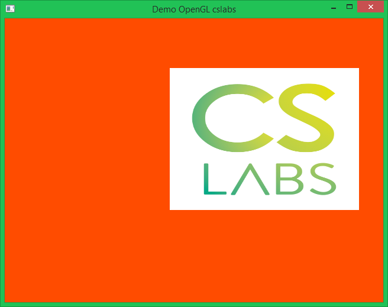

### Introduction à OpenGL: Matériel pour la formation

Slides et exemples de code en C pour accompagner la formation OpenGL de CSLabs

## Compilation sous Linux (Debian & dérivés)

Dépendances: 

 * gcc
 * make
 * glfw3, glew, headers opengl

TODO: apt-get <touslestrucs>

Pour chaque exemple, se placer dans son répertoire ( `cd 0Xmachintruc` ), et taper `make`.
`./demo` lance l'application
	
## Compilation des exemples sous Windows

Dépendances: 

 * mingw-64 (gcc, make)
 * glfw3, glew, headers opengl
	
TODO: tester sur une machine et tout installer from scratch

Pour chaque exemple, se placer dans son répertoire ( `cd 0Xmachintruc` ), et taper `mingw32-make`.
`./demo.exe` lance l'application
